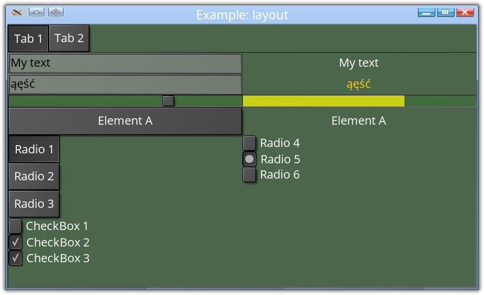

# fui

[](https://crates.io/crates/fui_core)
[](https://docs.rs/fui_core)
[](https://github.com/marek-g/rust-fui/blob/master/LICENSE.md)


MVVM Rust UI Framework Library.

## Documentation

[FUI's documentation](./doc/SUMMARY.md)

## Crates

### `fui_core` [](https://crates.io/crates/fui_core)

Core library of FUI MVVM UI Framework.

### `fui_macros` [](https://crates.io/crates/fui_macros)

Macros for FUI UI Framework.

### `fui_controls` [](https://crates.io/crates/fui_controls)

Standard controls for FUI UI Framework.

### `fui_controls_media` [](https://crates.io/crates/fui_controls_media)

Media controls for FUI UI Framework.

### `fui_app` [](https://crates.io/crates/fui_app)

Application backend of FUI UI Framework.

## Screenshots

Note! The visual aspect of the library is a subject to change. Margins are missing. You can also write your own styles and make it look completely different.




## Features

- cross-platform (currently: Windows, Linux)
- renderer agnostic (sample integration with OpenGL)
- MVVM model with properties, bindings, observable collections
- you do not care about redraw calls
- `ui!` macro for easier view creation
- extensive styling (style can change behavior)

## Example

```rust
#![windows_subsystem = "windows"]

use fui_app::*;
use fui_controls::*;
use fui_core::*;
use fui_macros::ui;

use std::cell::RefCell;
use std::rc::Rc;

use typed_builder::TypedBuilder;
use typemap::TypeMap;
use winit::window::WindowBuilder;

struct MainViewModel {
    pub counter: Property<i32>,
}

impl MainViewModel {
    pub fn new() -> Rc<RefCell<Self>> {
        Rc::new(RefCell::new(MainViewModel {
            counter: Property::new(0),
        }))
    }

    pub fn increase(&mut self) {
        self.counter.change(|c| c + 1);
    }
}

impl ViewModel for MainViewModel {
    fn create_view(view_model: &Rc<RefCell<Self>>) -> Rc<RefCell<dyn ControlObject>> {
        let vm: &mut MainViewModel = &mut view_model.borrow_mut();

        ui!(
            Horizontal {
                Text { text: (&vm.counter, |counter| format!("Counter {}", counter)) },
                Button {
                    clicked: Callback::new(view_model, |vm, _| vm.increase()),
                    Text { text: "Increase" }
                },
            }
        )
    }
}

fn main() -> anyhow::Result<()> {
    let mut app = Application::new("Example: button").unwrap();

    app.add_window(
        WindowBuilder::new().with_title("Example: button"),
        MainViewModel::new(),
    )?;

    app.run();

    Ok(())
}
```

[More examples](./fui_examples)

## License

Licensed under

 * GNU Lesser General Public License, Version 2.1 or newer ([LICENSE-LGPL-2.1](https://opensource.org/licenses/LGPL-2.1))
 * with WxWindows Library Exception 3.1, Version 3.1 or newer ([LICENSE-WxWindows-Exception-3.1](https://spdx.org/licenses/WxWindows-exception-3.1.html)).

It's essentially the GNU L-GPL except it allows static linking and distributing
derived works in binary form on the user's own terms. 

The project is partially based on code from other projects:

 * WPF's [Grid.cs](https://github.com/dotnet/wpf/blob/master/src/Microsoft.DotNet.Wpf/src/PresentationFramework/System/Windows/Controls/Grid.cs) on MIT license

### Contribution

Unless you explicitly state otherwise, any contribution intentionally submitted
for inclusion in the work by you, shall be licensed as above, without any
additional terms or conditions.
